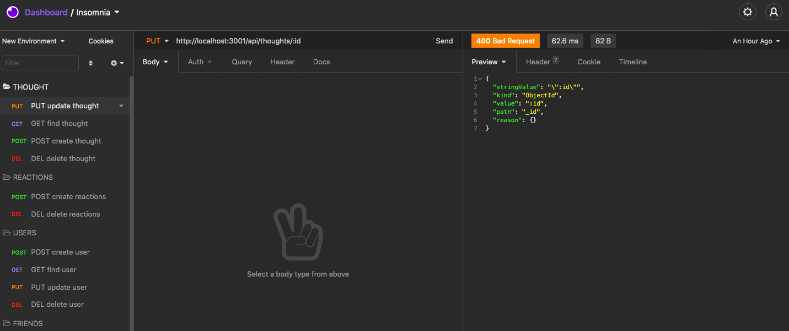

# social-network-api

## Description
A REST API for a social media startup app using Expres, MongoDB and Mongoose.

## Table of Contents
* [Usage](#usage)

* [Credits](#contributing)

* [Questions](#questions)

## Images

  

## Technologies

* JavaScript
* Node
* Express
* Mongoose

## Usage
A social media startup wants an API for their social network that uses a NoSQL database
so the website can handle large amounts of unstructured data.

## Deployment

Link to repo on [GitHub](https://github.com/Rachel-Reidenga/social-network-api/tree/master)

## Walkthrough Video
[Walkthrough Video]()

### Contributing

[w3schools.com](https://www.w3schools.com/)

[stackoverflow](https://stackoverflow.com/)

Shout out to Tanetta J, Monica H and Paul C

### Questions
If there are any questions please contact me [Rachel-Reidenga](https://github.com/Rachel-Reidenga) 